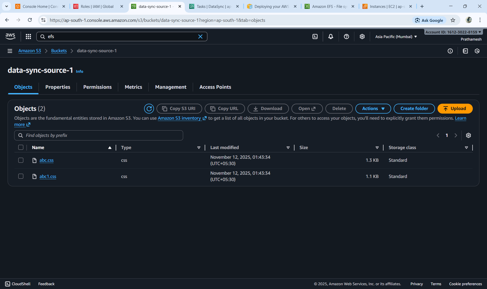
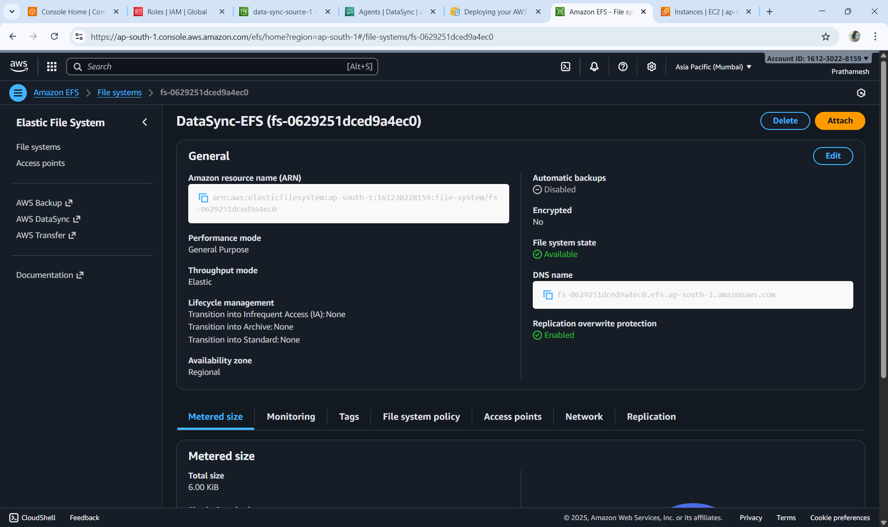
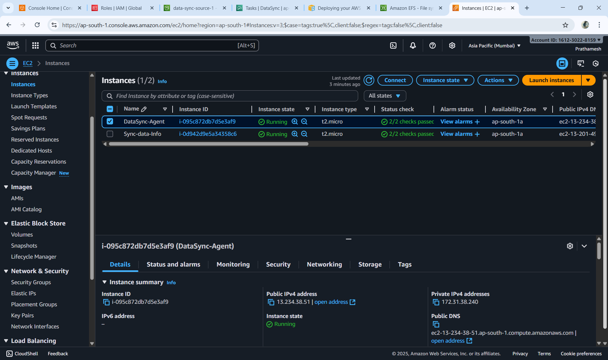
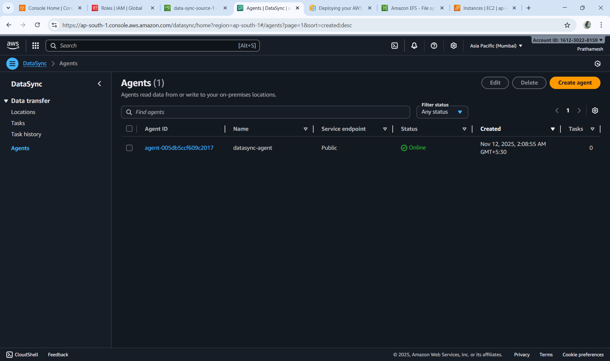
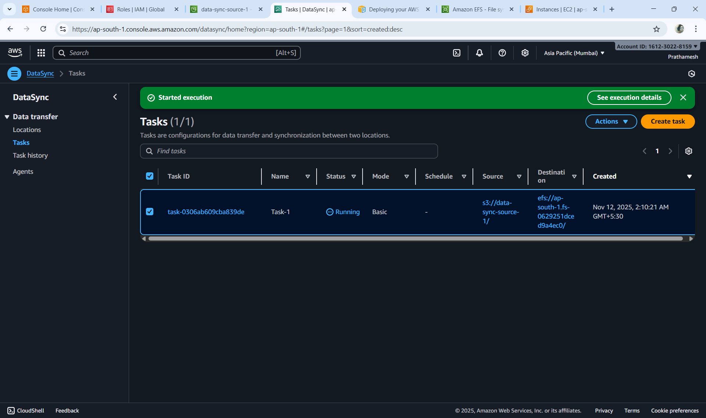
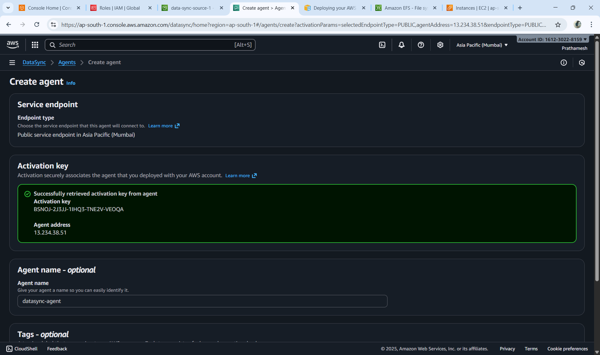
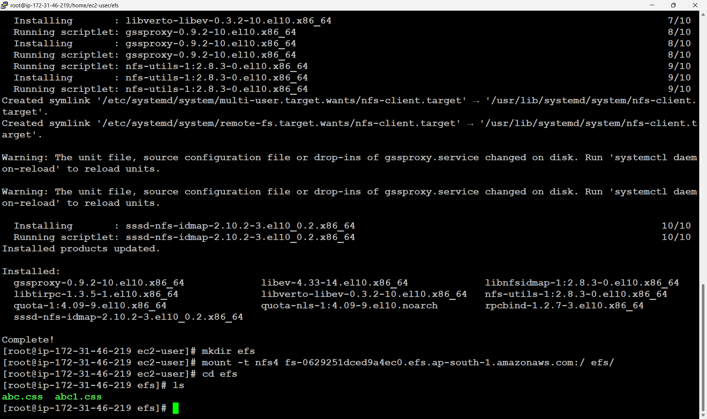

# 🚀 AWS Data Migration using AWS DataSync

## 📘 Project Overview
This project demonstrates how to **migrate data from an Amazon S3 bucket to an Amazon EFS file system** using **AWS DataSync**.  
AWS DataSync simplifies, automates, and accelerates large-scale data transfers between AWS storage services — providing a faster and more reliable migration workflow.

---

## 🎯 Objective
To securely and efficiently transfer files from **Amazon S3 (Source)** to **Amazon EFS (Destination)** using **AWS DataSync Agent** deployed on an **EC2 instance**.

---

## 🧠 Architecture
The overall architecture consists of the following components:
- **Amazon S3** → Source storage for data files.  
- **AWS DataSync** → Manages and automates data movement.  
- **Amazon EFS** → Destination file system to receive migrated data.  
- **Amazon EC2** → Hosts the DataSync Agent.  
- **IAM & Security Groups** → Provide necessary permissions and access controls.

---

## ⚙️ AWS Services Used

| Service | Purpose |
|----------|----------|
| **Amazon S3** | Stores the source data files |
| **Amazon EFS** | Destination file system to store migrated data |
| **AWS DataSync** | Automates and manages the data transfer process |
| **Amazon EC2** | Hosts the DataSync Agent and verifies migration |
| **IAM Roles** | Grants permissions to DataSync and related services |
| **Security Groups** | Enable NFS, SSH, and HTTPS connectivity |

---

## 🧩 Implementation Steps

### 1️⃣ Create a Private S3 Bucket
- Created a **private Amazon S3 bucket**.  
- Uploaded sample files to act as source data for migration.

📸 *Screenshot:*  


---

### 2️⃣ Create an EFS File System
- Created an **Amazon EFS** file system that will serve as the **destination** for migrated data.  
- Configured security groups and mount targets in the same VPC.

📸 *Screenshot:*  


---

### 3️⃣ Deploy AWS DataSync Agent
- Launched an **EC2 instance** using the **AWS DataSync Agent AMI** (pre-installed agent).  
- Activated the agent from the **AWS DataSync Console**.  
- Ensured the EC2 instance had outbound internet access to connect to DataSync endpoints.

📸 *Screenshots:*  
  


---

### 4️⃣ Create a DataSync Task
- Defined **Source Location** as the S3 bucket.  
- Defined **Destination Location** as the EFS file system.  
- Configured filters and transfer settings as required.

📸 *Screenshot:*  


---

### 5️⃣ Execute the DataSync Task
- Started the task to initiate data migration.  
- Monitored the transfer progress and verified that all source objects were copied successfully to EFS.

📸 *Screenshot:*  


---

### 6️⃣ Verify and Monitor in AWS DataSync Console
- Verified successful task completion through the **AWS DataSync Console**.  

## 🧾 Verification Steps (EC2)
Once the DataSync task completed successfully:
1. Launched another **EC2 instance** in the same VPC.  
2. Installed NFS utilities and mounted the EFS file system.  
3. Verified that all files were successfully migrated.

📸 *Screenshot:*  


---

```bash
sudo yum install -y nfs-utils

mkdir efs

sudo mount -t nfs4 fs-0629251dced9a4ec0.efs.ap-south-1.amazonaws.com:/ efs/

cd efs

ls

